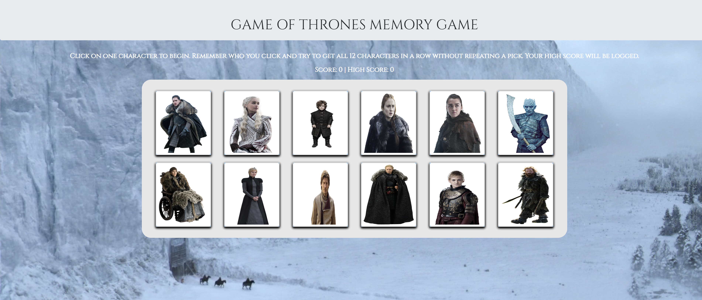

# KS-MEMORY-GAME

#### DEPLOYED APP:
https://ksentak.github.io/ks-memory-game/

---

---

#### APP DESCRIPTION:

This application is a memory game that was built using React.js. When the user loads the application, there will be twelve different character cards that are displayed on the page. The user must click through different characters without clicking on any single character more than once. Each time a character is clicked, the character cards are shuffled and arranged in a different order. The user's current score and high score will be logged and displayed on the page. If the user can click on all twelve different character cards in a row, they win. If the user clicks on a single character more than once, their score will be reset back to 0 and they can try again.

---

#### TECHNOLOGIES USED:
* React.js
* Node.js
* JavaScript
* HTML
* CSS
* Bootstrap

---

#### AUTHOR:
* Keaton Sentak - [Portfolio](https://keatonsentak.com) | [GitHub](https://github.com/ksentak)
